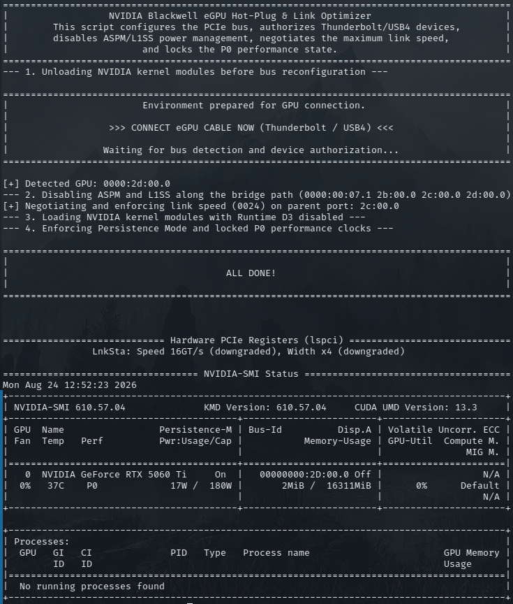

# NVIDIA Blackwell eGPU Hot-Plug & Link Optimizer Injector

An automated Bash utility designed for **Bazzite / Fedora Atomic** and general Linux environments. It handles seamless eGPU hot-plugging, PCIe link speed negotiation (**Gen3 / Gen4 / Gen5** up to **32 GT/s**), ASPM/L1SS power management overrides, and P0 performance state enforcement for **NVIDIA GeForce RTX 50-series (Blackwell)** eGPUs over **USB4, Thunderbolt 4, and Thunderbolt 5** connections.

---

<p align="center">
  
</p>

## ⚡ Key Features

* **Dynamic Bus Traversal**: Automatically discovers the root-to-device bridge path without hardcoded BDF addresses.
* **Full Link Negotiation (Gen4 / Gen5 Ready)**: Automatically queries device capabilities (`LnkCap`) and enforces the highest negotiated speed (Gen3 `8 GT/s`, Gen4 `16 GT/s`, or Gen5 `32 GT/s`).
* **Next-Gen Controller Support**: Fully compatible with Intel Barlow Ridge (JHL9480 / JHL9040R) Thunderbolt 5 controllers as well as standard USB4 / TB4 hosts.
* **Hardware ASPM / L1SS Disable**: Strips power-saving state latency across the entire PCIe bridge chain using `setpci`.
* **Runtime D3 Workaround**: Loads NVIDIA kernel modules with dynamic power management disabled to prevent bus desync and kernel panics on immutable systems.
* **Deterministic Clock Locking**: Automatically activates Persistence Mode and locks GPU/Memory clocks to maximum P0 states.

---

## 📋 Requirements

* **OS**: Bazzite, Fedora Silverblue/Kinoite, CachyOS, Arch Linux, or any modern Linux distribution.
* **Kernel & Modules**: Linux Kernel with `sysfs` Thunderbolt support enabled.
* **Drivers**: Official NVIDIA proprietary or open kernel modules (`nvidia-open` branch `610.xx` or newer).
* **Dependencies**: `lspci`, `setpci`, `boltctl`, `nvidia-smi`, `udevadm`.

---

## 🚀 Installation & Usage

1. **Clone the repository**:
   ```bash
   git clone https://github.com/DamianKA1993/blackwell-egpu-hotplug-injector.git
   cd blackwell-egpu-hotplug-injector
   ```

2. **Make the script executable**:
   ```bash
   chmod +x blackwell-egpu-hotplug-injector.sh
   ```

3. **Run before plugging in the cable**:
   ```bash
   sudo ./blackwell-egpu-hotplug-injector.sh
   ```

4. **Connect your eGPU**:
   When prompted, plug in the Thunderbolt/USB4 cable. The script will automatically authorize the device, negotiate link speed (Gen4/Gen5), disable ASPM, load the NVIDIA drivers, and print the resulting hardware status.

---

### 💻 Tested Hardware & Community Reports

If this injector script resolved your eGPU hot-plug or stability issues, please take 10 seconds to confirm your setup:

[](https://github.com/DamianKA1993/blackwell-egpu-hotplug-injector/issues/new?template=hardware_success.yml)

*(Click the button above to submit your device/OS setup directly)*

---


## 🔍 Verification

Once executed, verify your link status and clock states:

```bash
# Check link generation, width, and active clock speeds
nvidia-smi --query-gpu=name,pcie.link.gen.current,pcie.link.gen.max,pcie.link.width.current,clocks.current.graphics,clocks.current.memory --format=csv

# Verify hardware-level PCIe link registers
lspci -vv -d 10de: | grep -E 'LnkSta:'
```

---

## 📄 License

Distributed under the MIT License. See \`LICENSE\` for more information.
